# Box Outs

## Introduction

I chose to do an analysis on boxouts in the game provided. Rebounding is a huge part of basketball, with rebounding considered one of the four factors. There are many different aspects to rebounding, but one of them is box outs, where you prevent an opposing player from getting better positioning. This makes a player's chance of getting a rebound higher, and the opposing player's lower. It also helps set up the rest of your team.

I also apologize for the messiness of my code/markdown, I misread the deadline as due on Monday night instead of Sunday night.

## Process

I first went through the JSON files and found the snapshot of the times were there was judged to be a shot and the positions of all the players at that time. I also cross-referenced this with the play by play provided on the NBA website to ensure some accuracy: https://www.nba.com/game/cha-vs-tor-0021500492/play-by-play?period=All . I did this through identifying some thresholds:

SHOT_HEIGHT_THRESHOLD = 3.0

BASKET_POSITIONS = [(4, 25, 10), (90, 25, 10)]  # Both baskets

SHOT_PROXIMITY_RADIUS = 3.0

MIN_TIME_BETWEEN_SHOTS = 1.0

Once I found the shot timings, I then had to determine if a player was boxing out another. I made a limit of how far a player could be from both the rim and an opposing player. I then "paired up" opposing players based on distance to each other, with only one person on each team allowed to box out an opposing player for simplicity. 

Once that was done, I put that into a csv "shots_with_boxouts.csv" , which had the features such as the time, which basket it was on, player, team, and opponent among others.

## Analysis

### Terms

Some terms:

These are made up terms for the sake of simplicity:

Boxed out: in between basket and opposing player

Boxed in: opposing player is in between player and basket

So far every box out, there is a box out player and a box in player

### General and Success Rate

Overall, there were 289 box outs that I recorded. Here is a graph of total box outs per player: 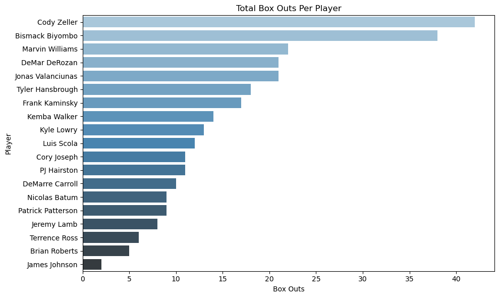

Graph of total box ins: 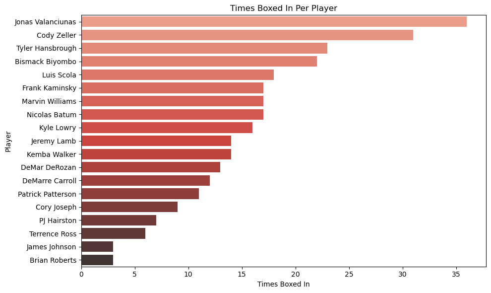

Graph of box outs per side: 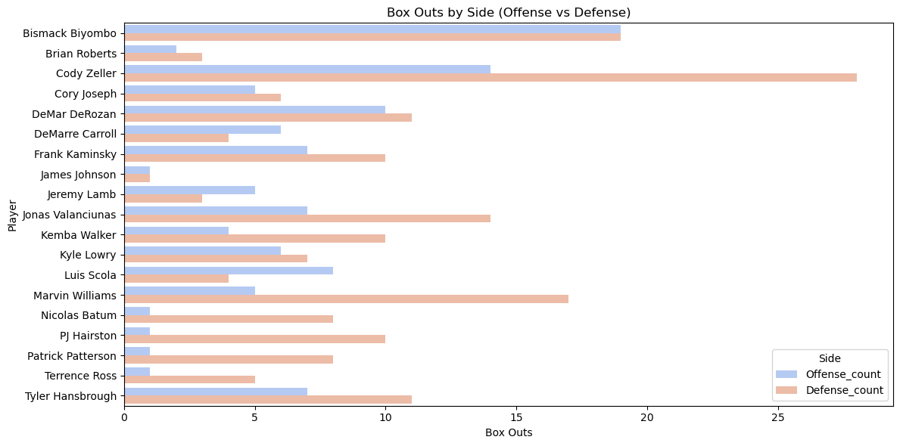

There was also additional analysis done on which position boxed in and boxed out each player, as well as the success rate (boxed in vs boxed out) of each player and team.

| Player Name       | Box Out Count | Boxed Out Count | Total Events | Box Out Success Rate (%) | Player Position |
|-------------------|---------------|-----------------|--------------|-------------------------|-----------------|
| Bismack Biyombo   | 38            | 22              | 60           | 63.333333               | C-F             |
| Brian Roberts     | 5             | 3               | 8            | 62.5                    | G               |
| DeMar DeRozan     | 21            | 13              | 34           | 61.764706               | G               |
| PJ Hairston       | 11            | 7               | 18           | 61.111111               | F-G             |
| Cody Zeller       | 42            | 31              | 73           | 57.534247               | C-F             |
| Marvin Williams   | 22            | 17              | 39           | 56.410256               | F               |
| Cory Joseph       | 11            | 9               | 20           | 55                      | G               |
| Frank Kaminsky    | 17            | 17              | 34           | 50                      | C               |
| Kemba Walker      | 14            | 14              | 28           | 50                      | G               |
| Terrence Ross     | 6             | 6               | 12           | 50                      | F-G             |
| DeMarre Carroll   | 10            | 12              | 22           | 45.454545               | F               |
| Patrick Patterson | 9             | 11              | 20           | 45                      | F               |
| Kyle Lowry        | 13            | 16              | 29           | 44.827586               | G               |
| Tyler Hansbrough  | 18            | 23              | 41           | 43.902439               | F               |
| Luis Scola        | 12            | 18              | 30           | 40                      | F               |
| James Johnson     | 2             | 3               | 5            | 40                      | F               |
| Jonas Valanciunas | 21            | 36              | 57           | 36.842105               | C               |
| Jeremy Lamb       | 8             | 14              | 22           | 36.363636               | G               |
| Nicolas Batum     | 9             | 17              | 26           | 34.615385               | G-F             |

| Team Name | Box Out Count | Boxed Out Count | Total Events | Box Out Success Rate (%) |
|-----------|----------------|------------------|---------------|---------------------------|
| Hornets   | 146            | 143              | 289           | 50.519031                 |
| Raptors   | 143            | 146              | 289           | 49.480969                 |

Based on these tables, it seems pretty even between teams.

### Position Analysis

Here is a heat map of box out vs box in positions: 

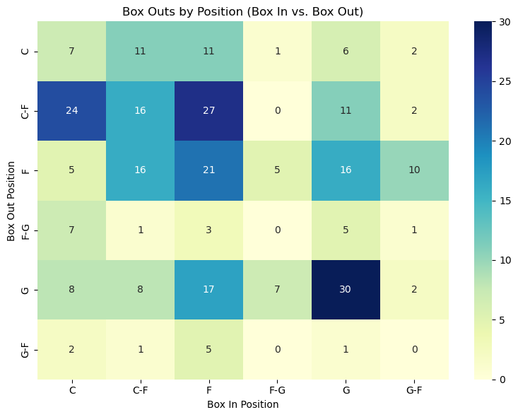

This would mean that there were 24 scenarios where a C-F was boxing out and a C was boxed in.

For comparing teams, here is a heatmap that shows the difference in positions. A positive number is better for the Hornets. For example, the Hornets used C-F to box out forwards 26% less than the Ratpors. The reason the last row is empty is because the Raptors do not have any G-F.: 

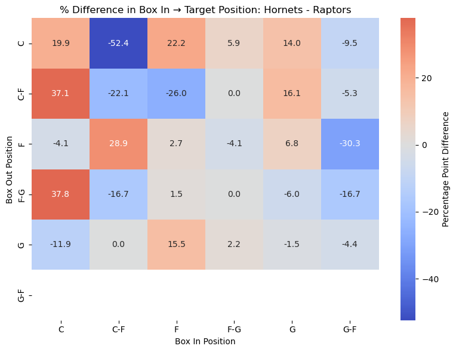

This is a stacked bar for each Hornets position and the distribution of the position of the Raptors player that was boxed in against them: 

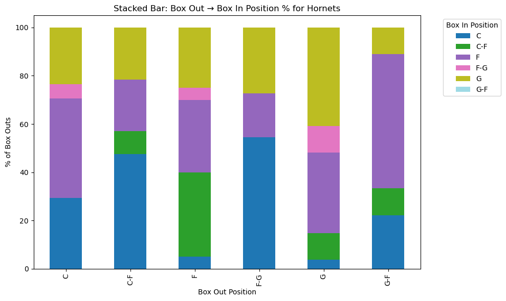

Here is a heat map of the difference between Hornets and Raptors playeres in getting boxed in. In this case, a negative number would be better for the Hornets. For example, the Raptors used guards to box out other guards 32.4% more.

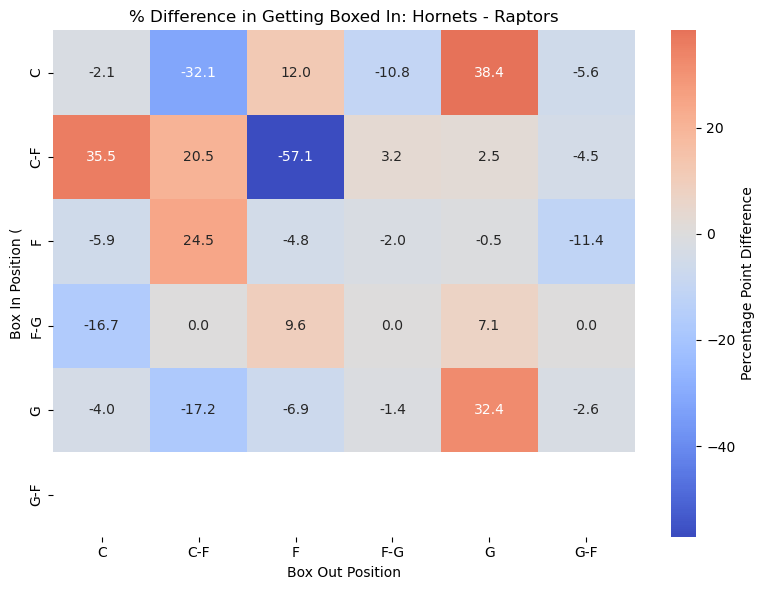

Again, here is a stacked bar, this time with each Hornets position and the distribution of the position of the Raptors player that boxed them out.

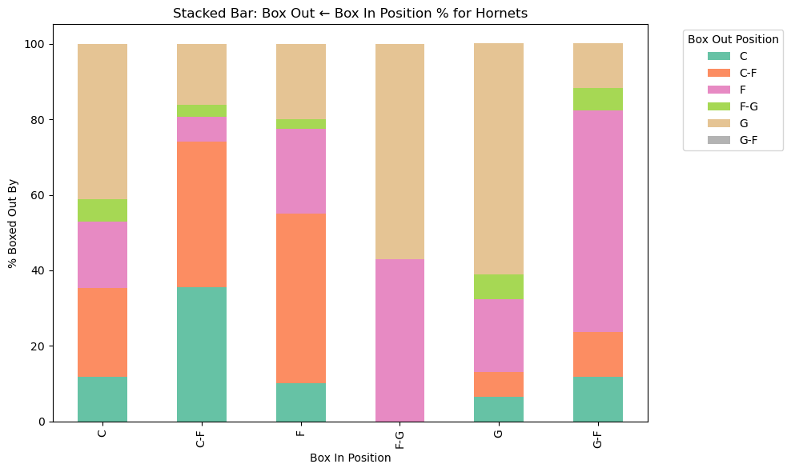

A couple of interesting findings were made when looking at the box out success (box out vs box in) based on team and position: 

| Position | Box Out Count | Boxed Out Count | Total Events | Box Out Success Rate (%) |
|----------|----------------|------------------|---------------|---------------------------|
| C-F      | 80             | 53               | 133           | 60.150376                 |
| F-G      | 17             | 13               | 30            | 56.666667                 |
| G        | 72             | 69               | 141           | 51.063830                 |
| F        | 73             | 84               | 157           | 46.496815                 |
| C        | 38             | 53               | 91            | 41.758242                 |
| G-F      | 9              | 17               | 26            | 34.615385                 |

| Team Name | Position | Box Out Count | Box In Count | Total Events | Box Out Success Rate (%) |
|-----------|----------|----------------|---------------|---------------|---------------------------|
| Raptors   | C-F      | 38             | 22            | 60            | 63.333333                 |
| Hornets   | F-G      | 11             | 7             | 18            | 61.111111                 |
| Hornets   | C-F      | 42             | 31            | 73            | 57.534247                 |
| Raptors   | G        | 45             | 38            | 83            | 54.216867                 |
| Hornets   | C        | 17             | 17            | 34            | 50.000000                 |
| Hornets   | F        | 40             | 40            | 80            | 50.000000                 |
| Raptors   | F-G      | 6              | 6             | 12            | 50.000000                 |
| Hornets   | G        | 27             | 31            | 58            | 46.551724                 |
| Raptors   | F        | 33             | 44            | 77            | 42.857143                 |
| Raptors   | C        | 21             | 36            | 57            | 36.842105                 |
| Hornets   | G-F      | 9              | 17            | 26            | 34.615385                 |

Raptors centers only had a 36% success rate in their box outs. This could be attributed to not having anyone to box out, as it would not have been recorded even if the player ends up getting a rebound. 

Additionally, how did the guards end up having a higher success rate than centers? Of course, guards will usually be boxing out other guards, but as we have seen through the past graphs there are times when a center will box out guards. After doing some digging, I found out that DeMar DeRozan was classified as a guard (which is debatable). This could explain how the Raptors guards had a 32.4% positive difference in boxing out other guards (although this could also be from Lowry being a pretty good rebounder for his size).
Note: DeRozan had 0 rebounds, but I will elaborate on that in the conclusion.

I decided to do some analysis with some new changes, getting rid of the combo positions provided:

DeRozan: G -> F 
Zeller, Biyombo: C-F -> C . These are the positions they play currently in the NBA.
Batum: G-F -> F . These are the positions they play currently in the NBA.
PJ Hairston: F-G -> F . This was based on seeing which position he boxed out the most.
Terrence Ross: F-G -> G . This was based on seeing which position he boxed out the most.

### Position Analysis Part 2 (DeRozan Edition)

As we can see, the players with position changes seem to mostly guard the position they were changed to:

| Player Name         | Most Frequent Boxer Position | Boxed By Count |
|---------------------|-------------------------------|-----------------|
| Bismack Biyombo     | F                             | 15              |
| Brian Roberts       | C                             | 1               |
| Cody Zeller         | C                             | 23              |
| Cory Joseph         | C                             | 3               |
| DeMar DeRozan       | F                             | 8               |
| DeMarre Carroll     | C                             | 8               |
| Frank Kaminsky      | G                             | 7               |
| James Johnson       | F                             | 2               |
| Jeremy Lamb         | G                             | 8               |
| Jonas Valanciunas   | C                             | 25              |
| Kemba Walker        | F                             | 7               |
| Kyle Lowry          | G                             | 8               |
| Luis Scola          | F                             | 12              |
| Marvin Williams     | F                             | 12              |
| Nicolas Batum       | F                             | 11              |
| PJ Hairston         | F                             | 7               |
| Patrick Patterson   | G                             | 7               |
| Terrence Ross       | G                             | 3               |
| Tyler Hansbrough    | C                             | 18              |

Here we can already see some differences:

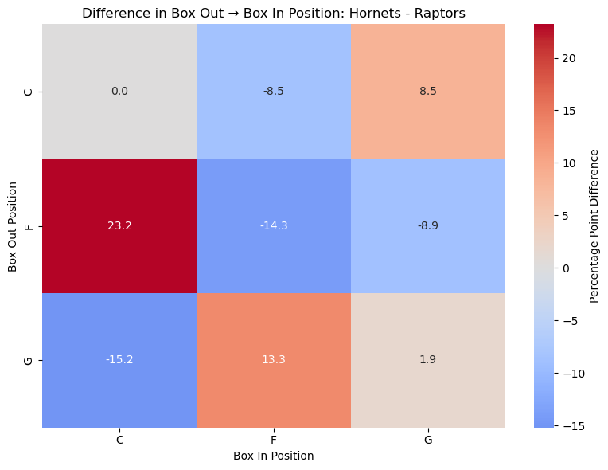

We can see that Ratpors had forwards (now including DeRozan) box out other forwards and guards more than the Hornets. Alternatively, the Hornets had their guards box out other guards and forwards more than the Ratpors. Since guards rebound less, switching DeRozan's position would make a huge impact due to his rebounding efforts.

Here is a stacked bar for the Ratpors with the old positions:

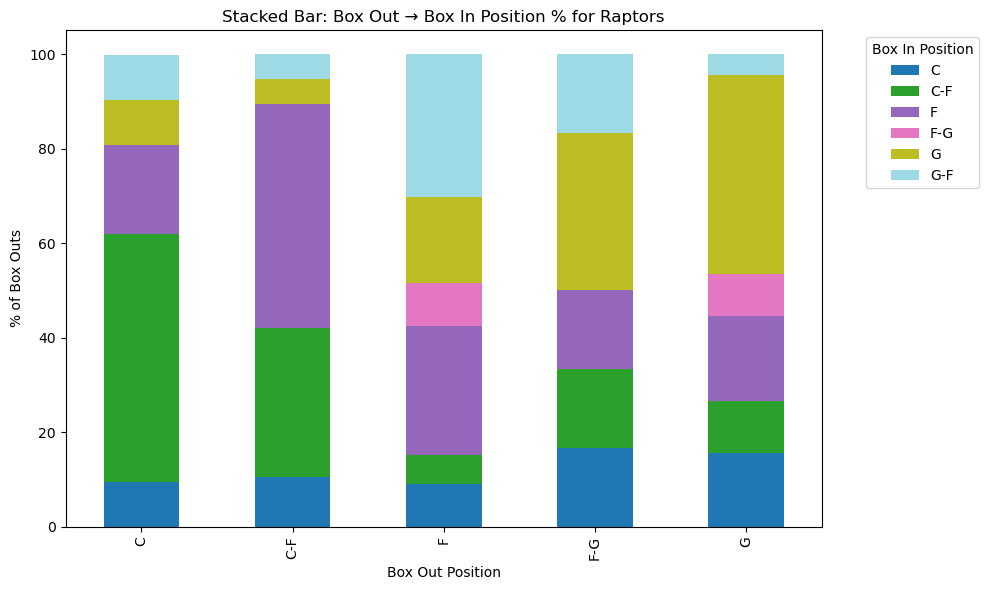

and the new positions:

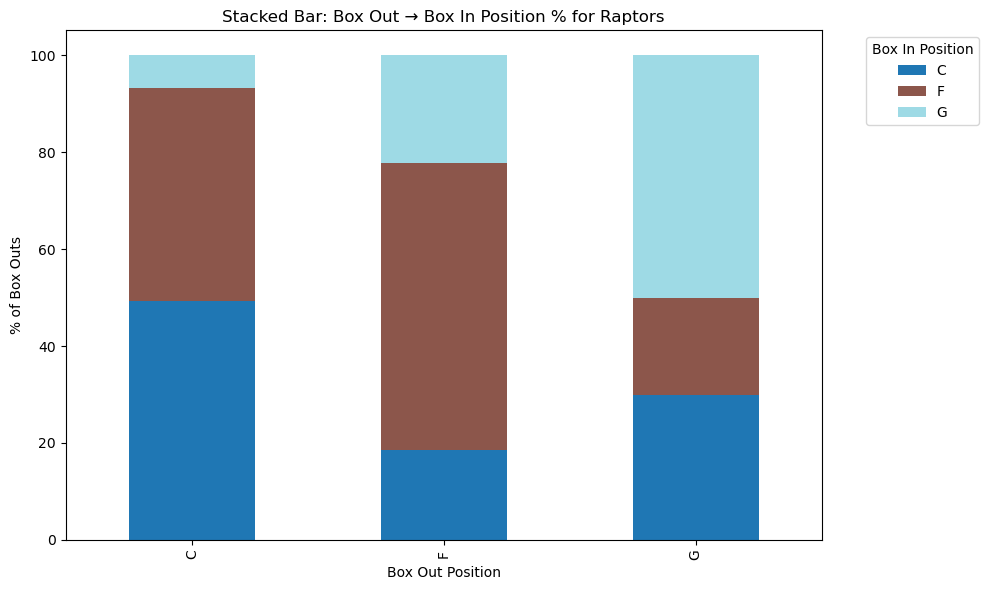

As we can see, the Raptors guards are boxing out less forwards without DeRozan.

In getting boxed in, we can also see a change:

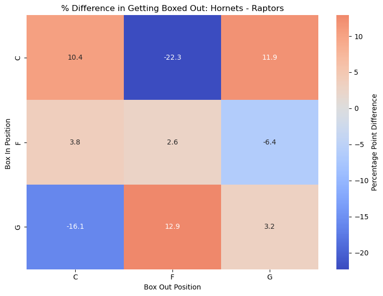

In guard vs guard situations, the Ratpors went from 32.4% more to 3.2% more, a drop of over 30%. This shows that DeRozan was a big part of boxing out. 

Here are the new aggregations after the position changes:

| Position | Box Out Count | Boxed Out Count | Total Events | Box Out Success Rate (%) |
|----------|---------------|-----------------|--------------|---------------------------|
| C        | 118           | 106             | 224          | 52.678571                 |
| G        | 68            | 69              | 137          | 49.635036                 |
| F        | 103           | 114             | 217          | 47.465438                 |

| Team Name | Position | Box Out Count | Boxed Out Count | Total Events | Box Out Success Rate (%) |
|-----------|----------|----------------|------------------|---------------|---------------------------|
| Hornets   | C        | 59             | 48               | 107           | 55.140187                 |
| Raptors   | C        | 59             | 58               | 117           | 50.427350                 |
| Hornets   | G        | 38             | 38               | 76            | 50.000000                 |
| Raptors   | G        | 30             | 31               | 61            | 49.180328                 |
| Raptors   | F        | 54             | 57               | 111           | 48.648649                 |
| Hornets   | F        | 49             | 57               | 106           | 46.226415                 |

This looks more correct, with centers getting more rebounds, along with guards and forwards having below a 50% success rate.

## Conclusion/Limitations

Something that stood out to me after I did this analysis was how it seemed that the rebounding was even, if not in the Hornets favor. The Hornets had a 50.51% success rate compared to the Rators' 49.48%, but if we look at the statistics of the game, we see that the Raptors had 54 rebounds compared to the Hornets 43. I boiled this down to a few reasons:

1. As stated earlier, if no one on the opposing team tries to go for a rebound it will not be counted

2. If a foul occurs on a shot, it will still log box outs, even though the play is dead.

3. A player can be close to an opposing player without actively trying to get a rebound (lack of effort).

4. There is an element of luck to who you are boxing out, especially on defense as it is usually the closest player to you.

5. Boxing out does not mean anything, DeRozan had 0 rebounds !!!, even though he had 21 box outs.

While the Hornets may have been more successful in box outs, they may have tried less. This high percentage could have been due to when they did try, they were successful. 

Boxing out does not mean everything, it just improves your chances of getting a rebound. Not every player on a team will rebound, especially on offense, so by sucessfully boxing out one player, it does make a big impact. Even though DeRozan had 0 rebounds, he was still taking away opposing player's chances to get a rebound. As we can see through the difference of rebounds in the game.

### Improvements

In the future I would look at the comparison of success rates of box out by position, instead of just seeing which positions boxed out who. I would also try to see how much impact height has, along with a way to measure the effort of rebounding. Thank you for reading this very long analysis.